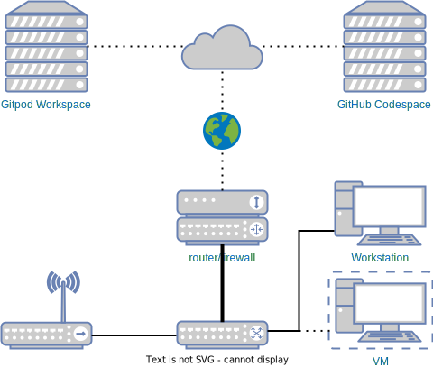

<br/>
<span style="font-size:3.6em;font-weight:bold">tailscale</span>
### <span style="text-transform:lowercase">from behind the firewall</span>

---

# What

  * WireGuard
  * mesh network

---

# Specifics

  * private overlay network
  * encrypted P2P connections
  * private services

---

# Who

  * Developers
	  * experimental services
  * Small business
	  * Work From Home
  * Enterprise
	  * Fine-grained access control

---

# Home setup


---

# VM

Uses my [dotfiles](https://github.com/gbraad/dotfiles) on Fedora

---

# Parts

Daemon
```sh
$ tailscaled &
```

```sh
$ systemctl start tailscaled
```

Control client
```sh
$ tailscale
```

Control server

https://login.tailscale.com/

---

# Tailnet

```
$ tailscale up
To authenticate, visit:

        https://login.tailscale.com/a/8e1c9e44ca05

Success.
```

---

# Let's add

[GitHub Codespaces](https://github.com/codespaces/new?machine=standardLinux32gb&repo=61788628&ref=main&location=SouthEastAsia&devcontainer_path=.devcontainer%2Fdevcontainer.json)

```sh
$ tailscale up
```

Now network should have 2 nodes

---

# Ping

```sh
$ tailscale ping ngage
pong from ngage (100.103.237.1) via 10.0.21.193:41642 in 2ms
```

---

# Direct link?

VM
```sh
$ watch -n1 \
	tailscale status
```

Codespace
```sh
$ tailscale ping [nodename]
```
Uses a relay to establish a path (DERP)

    100.103.237.1   ngage                gbraad@      linux   active; direct 10.0.21.193:41642

---

# What about

[GitPod Workspace](https://gitpod.io/#https://github.com/gbraad/devenv)

```sh
$ tailscale up
$ tailscale status
```

    100.112.112.8   workspace-to8ua08    gbraad@      linux   -
    100.103.237.1   ngage                gbraad@      linux   -
    100.88.207.80   ngage-podman         gbraad@      linux   -
    100.77.26.55    codespaces-88c2bb    gbraad@      linux   -

---



---

# Access

  * Send files
  * SSH

---

# Send files

Sender
```sh
$ echo "Hello, World" > hello
$ tailscale file \
	cp hello [nodename]:
```
Receiver
```sh
$ tailscale file \
	get ~/Downloads/
$ cat hello
```
You could use `ssh` for this, but does your phone?

---

# SSH

Host
```sh
$ tailscale up \
	--ssh                  # advertise SSH
```
Client
```sh
$ tailscale ssh [nodename]
$ ssh [nodename]           # * MagicDNS needs to be enabled
```

 Use of `nodename` will only work when MagicDNS is used

---

# Scale

  * SOCKS5 Proxy
  * Exit node

---

# Proxy

```sh
$ tailscaled \
	--tun=userspace-networking \
    --socks5-server=localhost:3215
```

```sh
$ curl \
	--proxy socks5://localhost:3215\
	https://ifconfig.co/json
```

---

# Exit node

Host
```sh
$ tailscale up \
	--advertise-exit-node
```
Client
```sh
$ tailscale up \
	--exit-node=[nodename] \
	--exit-node-allow-lan-access
$ curl ifconfig.co
```

Make sure to allow the use of the exit node from the control server


---

# tsnet (services)

Set up private services
  * [vmproxy](https://github.com/shayne/vmproxy), control and VNC access to a VM
  * [golink](https://github.com/tailscale/golink), a URL shortener
  * [caddy-tailscale](https://github.com/tailscale/caddy-tailscale), Caddy on a private address
  * [private-foundryvtt](https://github.com/spotsnel/private-foundryvtt-server), tabletop game server

---

# Control server

  * [Headscale](https://github.com/juanfont/headscale)

---

# Alternatives

  * [Nebula](https://github.com/slackhq/nebula) from slack
  * [ZeroTier](https://zerotier.com/) is much faster!

---

# Links

  * my [devenv](https://github.com/gbraad/devenv) setup
  * [dotfiles](https://github.com/gbraad/dotfiles/) configuration
  * [spotsnel](https://github.com/spotsnel) experiments

---
